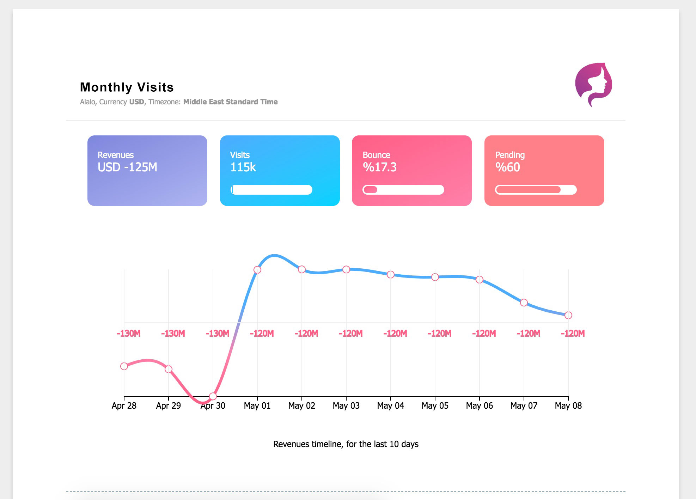

# Vertex 👓
Powerful JSX View Engine

**How it works:**
Vertex compiles and caches your JSX views to Hyperscript so they will get easily rendered to HTML using [vhtml](https://github.com/developit/vhtml).

Views will get compiled only when needed, giving you the performance boost.

To include partials in your view use the **include** directive.

# Getting Started

## Installation
```shell
npm install --save @vivida/vertex vhtml
```

## Getting Started

### Basic Setup

```js
const Vertex = require('@vivida/vertex').Vertex;

const engine = new Vertex();

engine.render('home', data).then(html => console.log(html)); // will render `views/home.jsx`
```

You can set the **views** and **cache** directories, by setting the parameters in the constructor

```js
const engine = new Vertex('/my/views/path', '/my/cache/path');
```

### Full Example

Create the needed views

- View: `views/index.jsx`

```jsx
const Header = include('header');
const Footer = include('footer');

module.exports = (props) => <div>
    <Header/>
    <div>{{ props.message }}</div>
    <Footer/>
</div>
```

- View: `views/header.jsx`

```jsx
module.exports = (props) => <div class="header">Header</div>
```

- View: `views/footer.jsx`

```jsx
module.exports = (props) => <div class="footer">Footer</div>
```

 - File: `index.js`

```js
const Vertex = require('@vivida/vertex').Vertex;

// the views directory
const viewLocation = __dirname + '/views';

// the cache directory
const cacheLocation = __dirname + '/cache';

const v = new Vertex(viewLocation, cacheLocation);

v.render('index', {message: 'Hello Vertex'}).then(html => console.log(html));

```

output:
```html
<div>
    <div class="header">Header</div>
    <div>Hello Vertex</div>
    <div class="footer">Footer</div>
</div>
```

## Using async/await instead

```js
import { Vertex } from '@vivida/vertex';

// the views directory
const viewLocation = __dirname + '/views';

// the cache directory
const cacheLocation = __dirname + '/cache';

const v = new Vertex(viewLocation, cacheLocation);

async function main() {

    const html = await v.render('index', {message: 'Hello Vertex'});

    console.log(html);

}

main();
```

> **Note:** The `cacheLocation` directory should be writable by user process

## Constructor Arguments

- **viewLocation** `string` defaults to `./views`: the views root directory
- **cacheLocation** `string` defaults to `./cache`: the cache directory, it should be writable by the engine process
- **alwaysRecompile** `bool` defaults to `false`: useful for development, always recompile the views

## Report / Charts example

```jsx
<Report>
    <div class="container">
        <Row mainAxisAlignment="space-between">
            <Metric.PurpleGradient width="170" height="100" title="Global">
                <Number currency={props.client.currencyId} format="a"
                    value={today.total_Base} />
            </Metric.PurpleGradient>

            <Metric.BlueGradient width="170" height="100" title="Cash" progress={percentage(today.totalCash_Base, today.totalAbsolute_Base)}>
                <Number currency={props.client.currencyId} format="a"
                    value={today.totalCash_Base} />
            </Metric.BlueGradient>

            <Metric.RedGradient width="170" height="100" title="Debt" progress={percentage(today.totalDebt_Base, today.totalAbsolute_Base)}>
                <Number currency={props.client.currencyId} format="a"
                    value={today.totalDebt_Base} />
            </Metric.RedGradient>

            <Metric.OrangeGradient width="170" height="100" title="Facilities" progress={percentage(today.totalFacilities_Base, today.totalAbsolute_Base) || 0.1}>
                <Number currency={props.client.currencyId} format="a"
                    value={today.totalFacilities_Base} />
            </Metric.OrangeGradient>
        </Row>
    </div>

    <Section>
        <Chart
            width={chartWidth}
            height={280}
            description="Global position timeline, for the last 10 days"
            xFormat={x => moment(x).format('MMM DD')}
        >
            <Chart.Curve
                colors={['#ff5e85', '#ff80aa', '#4cadfe']}
                name="Global Position"
                data={overview.map(x => [x.date, x.total_Base])}
            />

        </Chart>
    </Section>
</Report>
```



Follow https://twitter.com/ahmadmuzavi for any updates about Vertex.